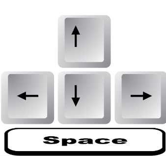

# Crazy Lab shooter Game 

This project consisted of building a simple shooter game using phaser and  javascript vanilla

## Screenshots

## What is this game ?
Dr. Kureijī is an adventurous foolish Doctor willing to try new experiments. 
One night, while Dr. Kureijī was doing his lab experiments, he made a mistake with the ingredients which lead to the creation of small evil creatures that cannot be controlled. not only that, these creatures can transform only by touching solid objects.
In this game, we need to help Dr. Kureijī to eliminate these creatures to protect his spaceship and himself eventually.

## How to Play the Game


Use Q S D W  Keys to move, Space Key to shoot.

## Built With 🔨
- Javascript Vanilla 
- Phaser 3 JS
- Webpack


## Live Demo 🚀
[crazy Lab]()

## Getting Started 💻

## Installation

To get a local copy of the repository please run the following commands on your terminal:

```
$ cd <folder>
```

```
$ git clone git@github.com:rahalrazika/Shooter-game.git
```

## Testing 
Below shows the following commands you will need to run tests:
1- Install Jest using yarn: 
```
yarn add --dev jest

```
- or npm :
```
npm install --save-dev jest

```
2- Or just run  
```
npm install

```
to initialize the project

3- To run the tests, execute
```
npm run test 

```
or 
```
yarn test 

```
## Author

👤 **Razika Rahal**

- Github: [@rahalrazika](https://github.com/rahalrazika)
- Linkedin : [Razika Rahal](https://www.linkedin.com/in/razika-rahal-85539bbb/)
- Twitter: [@Razika Rahal](https://twitter.com/RahalRazika)


## 🤝 Contributing

Contributions, issues and feature requests are welcome!

## Show your support

Give a ⭐️ if you like this project!

## Acknowledgments

-  Odin projects
-  Microverse
